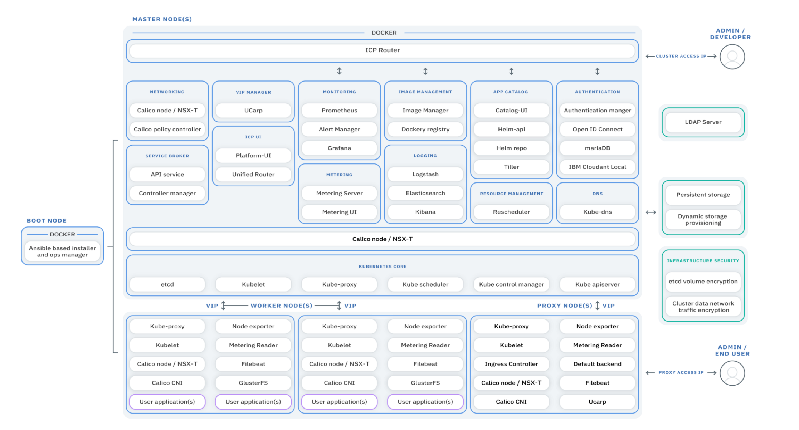
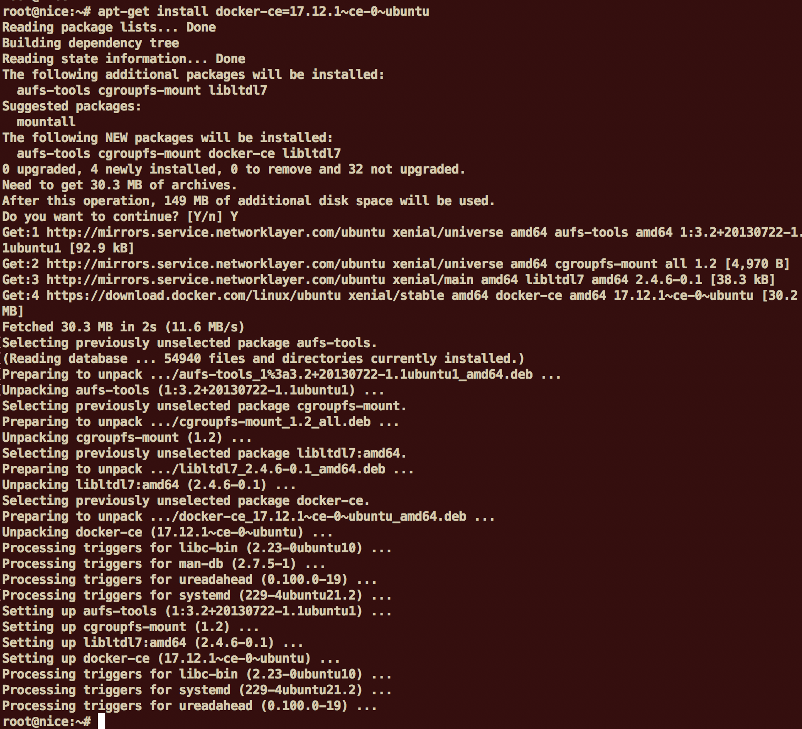
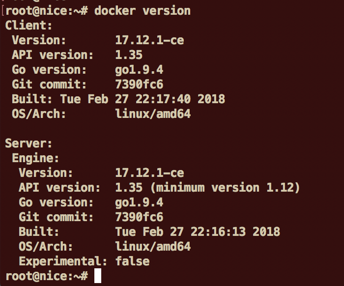
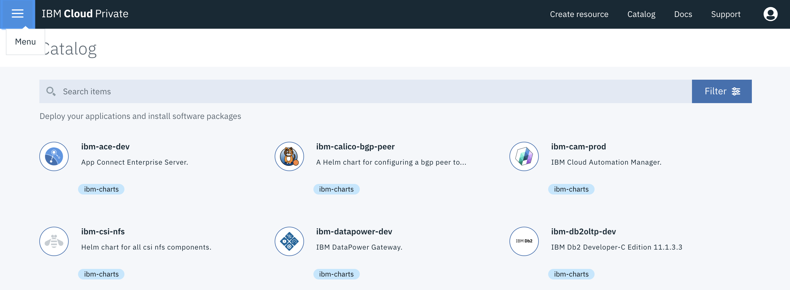
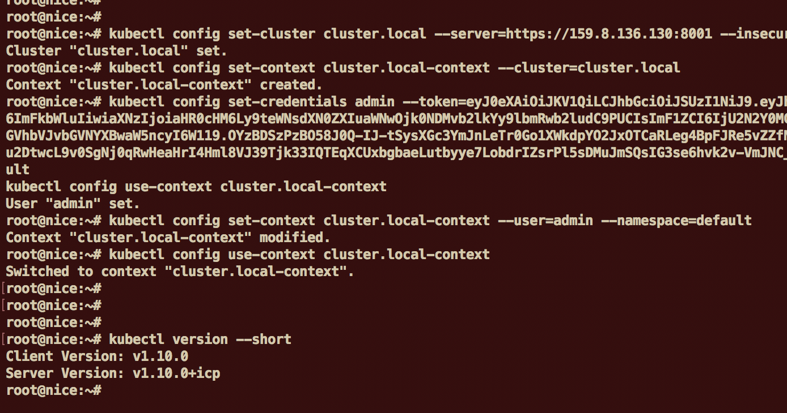

<div style="background-color:black;color:white; vertical-align: middle; text-align:center;font-size:250%; padding:10px; margin-top:100px"><b>
 Installing IBM Cloud Private
 </b></a></div>

---
# Single Node Installation of IBM Cloud Private
---


+++


# Table of Content

[[toc]]


+++

# 1. IBM Cloud Private Overview

**IBM Cloud Private** is a private cloud platform for developing and running workloads locally. It is an integrated environment that enables you to design, develop, deploy and manage on-premises, containerized cloud applications behind your firewall. It includes the container orchestrator Kubernetes, a private image repository, a management console and monitoring frameworks.

### What is private Cloud

 Private cloud is a cloud-computing model run solely for one organization. It can be managed internally or by third party, and can be hosted behind the company firewall or externally. Private cloud offers the benefits of a public cloud, including rapid deployment and scalability plus ease of use and elasticity, but also provides greater control, increased performance, predictable costs, tighter security and flexible management options. Customize it to your unique needs and security requirements.

### Terminology

- **master node** :  
    - controls and manages the cluster
    - **Kubectl**:  command line client
    - REST API:  used for communicating with the workers
    - Scheduling and replication logic
    - Generally 3 or more master nodes for resiliency
- **worker node** 
    - is a worker machine in Kubernetes, previously known as a minion. A node may be a **VM** or **physical machine**, depending on the cluster. Each node has the services necessary to run pods and is managed by the master components.
    - **Kubelet**  agent that accepts commands from the master
    - **Kubeproxy**: network proxy service on a node level, responsible for routing activities for inbound or ingress traffic
    - Docker host
- **Containers**: Units of packaging 
- **Pods**:
    - A collection of containers that run on a worker node
    - A pod can contain more than one service
    - Each pod has it’s own IP
    - A pod shares a PID namespace, network, and hostname
- **Replication Controller**
:
    - Ensures availability and scalability 
    - Responsible for maintaining as many pods as requested by the user
    - Uses a template that describes specifically what each pod should contain
- **Labels**:

    - Metadata assigned to K8 resources – such as pods, services
    - Key-Value pairs for identification 
    - Critical to K8s as it relies on querying the cluster for resources that have certain labels
- **Services:**
    - Collection of pods exposed as an endpoint
    - Information stored in the K8 cluster state and networking info propagated to all worker nodes
- **Secrets**:
    - Sensitive information that containers need to read or consume
    - Are special volumes mounted automatically so that the containers can read its contents
    - Each entry has it’s own path 
 

### Architecture

See below a picture showing ICP architecture and most common components.



This lab is going to focus on the couple "Docker & Kubernetes" which is the main foundation of IBM Cloud Private. 

# 2. Objectives


In this workshop, you will prepare and install IBM Cloud Private (ICP) on a **single node** (host) running on a VM (thru VMware, Virtual Server in a Cloud or VirtualBox).

You will learn how to:

- prepare your platform to support a single node ICP (i.e all nodes - master, worker, proxy, boot nodes will be concentrated in one node)
- configure the installation setup for ICP
- check and validate all the prerequisites
- install Docker and Hyperkube
- check all the components 


# 3. Prerequisites

This lab needs some hardware and software prerequisites.

At least (minimal):
- [ ] one host (physical or virtual)
- [ ] CPU = 8 cores
- [ ] RAM = 10 GB (10,240 MB)
- [ ] Storage = 40 to 80 GB

Depending on the installation types:
- [ ] First option: Ubuntu 16.04 (Sever or Desktop) in a **VMware VM**
- [ ] Second Option:  Vagrant and **VirtualBox**

If you need some more help, see the official documentation: [here](https://www.ibm.com/support/knowledgecenter/en/SSBS6K_2.1.0.2/kc_welcome_containers.html)
https://www.ibm.com/support/knowledgecenter/en/SSBS6K_2.1.0.2/kc_welcome_containers.html

# 4. First Option: Install ICP on Ubuntu VM

Be sure that you have already prepared a VMwareVM (see Appendix A) or a virtual server containing a **Ubuntu** system up and running. Login to the Ubuntu system as **root** or sudo -i once connected.

Here are the steps :

### Task 1 : Update the system

Before updating the operating system, check the **/etc/hosts** file in Linux.

Use **putty** or **ssh** to get connected to the ubuntu VM. For example (replace the ip@ with the one given for this lab) :

`ssh root@192.168.225.132 `

The password should be **password**.


Once connected, check your ip address by typing the command:


`ifconfig`


Then, edit the hosts file with this command:

` nano /etc/hosts  `

Change the following line:

**127.0.1.1      ubuntu**

to your ip address (that could be different from the following line):

**192.168.225.132**      ubuntu

Save the file (ctrl O, enter, ctrl X )

Your /etc/hosts file should looks like that:


Use the following command to **update** the system with some complementary packages:

```console
apt-get install apt-transport-https ca-certificates curl software-properties-common python-minimal
```

Check carefully the output to see if you have errors and especially if you cannot connect.

Increase your virtual memory maximum by typing the command:

`sysctl -w vm.max_map_count=262144 `


### Task 2 : Add Docker’s official GPG key

Use the following command:

```console
curl -fsSL https://download.docker.com/linux/ubuntu/gpg | apt-key add -
```

### Task 3: Add a repo to get the Docker

Use the following 2 commands:

```console
add-apt-repository "deb [arch=amd64] https://download.docker.com/linux/ubuntu $(lsb_release -cs) stable"
```

`apt-get update `

### Task 4: Get Docker

You can list all versions available in the added repo:

`apt-cache madison docker-ce `

Use the following command to get Docker installed (Docker version 17.09 is the version supported by IBM Cloud Private 2.1.0.2):

`apt-get install docker-ce=17.09.0~ce-0~ubuntu `



Check that Docker is running (client and server):

`docker version `



> Docker client is mainly the CLI. The server is composed of different programs and among then, there is the **containerd**, the engine managing the isolation/running of containers. 

You can look around at the docker CLI (and go thru some of  the sub-commands) by just typing:

`docker`

`docker ps`

`docker images`

Another lab will go in detail to explain how Docker is managing the images and running them.

### Task 5: Download IBM Cloud Private

We are going to use Docker to download the ICP-ce (community edition) package from the **dockerHub** web site:

`docker pull ibmcom/icp-inception:2.1.0.2 `

IBM has packaged all the main components necessary for the installation in one package (note that you can change the version to a more recent one if needed). The pull sub-command is going to download the image on the local file system (the image  can be run to install ICP).


Create a directory and move to that directory:

`mkdir /opt/icp`

`cd /opt/icp `  

Copy the ICP package into that directory:

```console
docker run -e LICENSE=accept -v "$(pwd)":/data ibmcom/icp-inception:2.1.0.2 cp -r cluster /data `
```

> Note:  this docker command is executing the linux copy (cp) command from the volume (-v parameter). This will create a cluster directory with all necessary files.


### Task 6: SSH Keys setup 

We are going to generate new ssh keys in the /opt/icp/cluster directory:

`ssh-keygen -b 4096 -f ~/.ssh/id_rsa -N "" `

`cat ~/.ssh/id_rsa.pub | sudo tee -a ~/.ssh/authorized_keys `

`systemctl restart sshd ` 

`cp ~/.ssh/id_rsa ./cluster/ssh_key  `

> Finally a new key should now exist in the /opt/icp/cluster:


### Task 7: Customize ICP

Add the IP address of each node in the cluster to the /opt/icp/cluster/hosts file (in our case, we use the **same ip address** for each component). 
> Your IP address could be different from the one used here. 

`nano /opt/icp/cluster/hosts`


Save the file (ctrl O, enter, ctrl X ).

To understand the installation setup, you can look at the /opt/icp/cluster/config.yaml where you will find all the parameters. 

`more /opt/icp/cluster/config.yaml` 

No need to change for default installation. 

**You are now ready to install IBM Cloud Private**.


### Task 7: Install ICP

Finally install ICP by using those commands:

`cd /opt/icp/cluster  `

```console
docker run -e LICENSE=accept --net=host -t -v "$(pwd)":/installer/cluster ibmcom/icp-inception:2.1.0.2 install
```

Installation should last around 30 minutes. Check messages.
In case of error, make the appropriate change in the configuration files. Sometimes the installation can slowdown a little bit with **Retrying** messages  (during Cloudant or IAM startup for instance).


> Note that during a standard installation, there are no failures and no errors. If some errors occur and the install exits then first retry the install command and follow the instructions. If it doesn't work then "uninstall" ICP, correct the issue and restart the install process.

> **After the end of the installation, WAIT 5 MINUTES BEFORE GOING TO THE NEXT STEP**(i.e logging to the master).


Use the green link to get access to the console (admin/admin) in a browser:

`https://192.168.225.132:8443 `  


You should receive the **Welcome Page**:


Click on the **Hamburger** menu (top left) to look at all the possibilities:



Click on **Catalog>Helm** Charts to visit the Catalog (it could take au few seconds to refresh the first time):


You can look at the (helm) catalog and visit some entries (but don't create any application at the moment).

### Task 8: Install and configure CLIs  (kubectl, bx px, bx dev)

At this point, you will need to install the **Kubernetes CLI** (command kubectl).  
For that purpose, open a ssh terminal with the Ubuntu VM in root mode and type the following command:

```console
docker run -e LICENSE=accept --net=host -v /usr/local/bin:/data ibmcom/icp-inception:2.1.0.2 cp /usr/local/bin/kubectl /data
```

This docker command will copy the kubectl program to the /usr/local/bin. 

Now, you need to setup the endpoint to tell the kubectl command where is the ICP Cluster and what are the correct certificates. 
To do so, go to the ICP console and select your profile on the right hand:


Click on Configure client:


Then Copy & Paste the 5 lines into the ssh terminal.

> You can also copy these lines to a text file for further use



As a result, you will see that you are now **connected** to our cluster (with only one node):

`kubectl version --short`

`kubectl get nodes`

> After a long period of inactivity, if you see some connection error when typing a kubectl command then redo that step.

To get help from the kubectl, just type this command:

`kubectl`


> **Optional** : it could be interesting to define an alias name for docker and kubectl commands. 

To do so, from the ssh terminal, type the following commands:

`cd`
 
`nano .bashrc`

At the end of the file, add the 2 lines:

```console
alias k=kubectl
alias d=docker
alias h=helm 
```

Save the file (ctrl O, enter, ctrl X ). Source your script with the following command:

`source .bashrc`

Now test your new commands:


Finally, you can also install the bx command:

`curl -fsSL https://clis.ng.bluemix.net/install/linux | sh`


the **bx** command is a genereric command for all the IBM Cloud (private and public). The name bx comes from Bluemix. The bx command is using pugins to add some features.

Now, download the bx pr **plugin** to get the ICP specific commands:

```console
wget https://192.168.225.132:8443/api/cli/icp-linux-amd64 --no-check-certificate
```


Finally add this plugin to bx:

`bx plugin install icp-linux-amd64`
`bx plugin show icp`


Before using the 'bx pr', you must login to the master:

`bx pr login -a https://192.168.225.132:8443 --skip-ssl-validation`

> For the login : admin/admin 


Now you can type few commands concerning your cluster:

`bx pr masters mycluster`


Among all sub-commands in 'bx pr', there are some commands to manage the infrastructure components like :
- cluster
- workers (adding, removing ...)
- register


Finally also add the 'bx dev' plugin to successfully use the **Microservice Builder**:

`bx plugin install dev -r Bluemix`


### Task 9: Adding persistent storage to Kubernetes

Go to the ICP management console and click on the menu (top left hand side).
Select **Dashboard** in the menu.


Normally after the installation, all internal storage is used by ICP (so that's why we see 0 % available in the storage metric). 
We are now going to add some persistent storage.
In the terminal, use the following commands:

`cd /tmp`

`mkdir data01`

Open a file with that command:

`nano pv-rwo.yaml`

Copy and paste the following text in the file (this is a kubernetes document):

```console
apiVersion: v1
kind: PersistentVolume
metadata:
  name: hostpath-pv-once-test1
spec:
  accessModes:
  - ReadWriteOnce
  capacity:
    storage: 1Gi
  hostPath:
    path: /tmp/data01
  persistentVolumeReclaimPolicy: Recycle
```
Save the file (ctrl O, enter, ctrl X ).

With that document, we are telling Kubernetes to create a persistent storage of 1GB with read/write once mode in the host path /tmp/data01.

To create this persistent volume, just type the following command:

`kubectl create  -f ./pv-rwo.yaml`


Now create a 2GB persistent storage volume with read/write/many mode:

`nano pv-rwm.yaml`

Copy and paste the following text in the file (this is a kubernetes document):

```console
apiVersion: v1
kind: PersistentVolume
metadata:
  name: hostpath-pv-many-test1
spec:
  accessModes:
  - ReadWriteMany
  capacity:
    storage: 2Gi
  hostPath:
    path: /tmp/data01
  persistentVolumeReclaimPolicy: Recycle
```
Save the file (ctrl O, enter, ctrl X ).
And then use the following command:

`kubectl create  -f ./pv-rwm.yaml`

Once created these 2 volumes (hostpath) should be listed with the following command:

`kubectl get pv`


> Note: the 2 volumes are shown as available storage. 

Now go back to the Dashboard to see the change:


### Task 10: End of installation

At this point, you can now go thru some other labs to implement applications using containers and Kubernetes solutions. 


# 5. Second Option: Using Vagrant and VirtualBox

This option is an alternative to the previous (simple) detailled installation. We are not covering this installation for the moment but you can try it on your own laptop. 
This ICP installation uses VirtualBox (that you need to install as a prerequisites).

The link below explain the steps:

https://github.com/IBM/deploy-ibm-cloud-private/blob/master/docs/deploy-vagrant.md

Note: this installation is using ICP version 2.1.0.1 instead of the latest one. You should change the version to 2.1.0.2 in the configuration file. Also don't stop the VM and use the vagrant suspend command. 


# 6. Conclusion

###  Results
<span style="background-color:yellow;">Successful exercise ! </span>
You finally went thru the following features :
- [x] You setup a VM using Ubuntu version 16.04
- [x] You checked all the prerequisites before the ICP installation
- [x] You installed Docker 
- [x] You installed ICP community edition (version 2.1.0.2) on one host
- [x] You connected to the ICP console
- [x] You setup the kubectl command line
- [x] You setup some persistent storage
- [x] You installed a functional Kubernetes Cluster on a single Node for testing and learning

---
# End of Lab
---

#  appendix A : Preparing your VM (VMWare) with Ubuntu

###  Task A1 - Download Ubuntu

Download the Ubuntu server **version 16.04.04** (ubuntu-16.04.4-server-amd64.iso) on your laptop.

###  Task A2 - Create a VM

Open VMWare Workstation or VMWare Fusion depending if you are running Windows or MacOS. Create a **new custom VM** with the following **customized** settings:
- Ubuntu 64 bits
- 8 cores
- 10 GB of RAM
- Change to 80 GB of storage in the hard drive
- NAT (or Share with my Mac) for the Network
- Specify the downloaded file in the DVD (ubuntu-16.04.4-server-amd64.iso) and check "connect the DVD Drive"
- Save the settings and start the VM

###  Task A3 - Set the language

Select English as the language by default


###  Task A4 - Set the keyboard

Select your keyboard by **typing F3** and then choose a language for your Keyboard


###  Task A5 - Install Ubuntu Server

Press enter to install Ubuntu server


Press enter to use English as the language by default


###  Task A6 - Select Location

Select your location (Other>Europe>France for example)


###  Task A7 - Select locales

Select your locales (Other>Europe>France for example)


###  Task A8 - Choose a hostname

Change the hostname of leave the default (UBUNTU)


###  Task A9 - Choose a username

Choose a user name (phil in my example)


###  Task A10 - Type a password

Choose a user name (phil in my example) and choose a password (password) and do not encrypt the home directory


###  Task A12 - Partition your disk

Choose "use entire disk" and accept the partitionning


###  Task A13 - No Proxy

Now the package manager "apt" gets configured. Leave the HTTP proxy line empty
unless you're using a proxy server to connect to the Internet


###  Task A14 - Launch the installation

I like to update my servers automatically. Therefore, I select Install Security
Updates automatically


###  Task A15 - Add some packages

The only items I select here are **OpenSSH server**, **Standard System
Utilities**, **manual package selection** and **Virtual Host** so that I can immediately connect to the system with an SSH client such as PuTTY after the installation has finished


###  Task A16 - GRUB

Accept to install GRUB and this will end the installation process with a reboot of the VM


###  Task A17 - Login for the first time

First login with  your credentials (that you defined during the installation) **from the VMware console**


###  Task A18 - Get the IP address

Get the IP address of this virtual machine by typing:

``` ifconfig ```

In that case look at the Ethernet interface and get the inet addr : 192.168.225.132 (for example)


###  Task A19 - SSH to the VM

Connect by using ssh (the user name and the ip address):

``` ssh phil@192.168.225.132 ```

Enter yes and then your password


Set a password to root by using the following command:

```sudo -i```

```passwd```


###  Task A20  - Update the OS

Update the Ubuntu VM. Type the following command (be sure to be root):

``` apt update ```


###  Task A21 - Define the network interface

Update the network interface:

``` nano /etc/network/interfaces ```

Modify the primary interface (in this example ens33) by adding some static definitions

> auto ens33
>
> iface ens33 inet static
>
> address 192.168.225.7
>
> netmask 255.255.255.0
>
> network 192.168.225.0
>
> broadcast 192.168.225.255
>
> gateway 192.168.225.2
>
> dns-nameservers 192.168.225.2 8.8.8.8


Be careful:  the interface name, the IP address, the gateway address and netmask could be different (refer to the ifconfig command to get the right names and IPs)


Save the file (ctrl O, enter, ctrl X )

Also edit the ssh config to authorize the root login:

``` nano /etc/ssh/sshd_config ```


Save the file (ctrl O, enter, ctrl X )

Edit the hosts file with this command:

` nano /etc/hosts  `

Change the following line:
127.0.1.1      ubuntu

to your ip address:

**192.168.225.132**      ubuntu

Save the file (ctrl O, enter, ctrl X )

**REBOOT YOUR VM**:

``` shutdown -r 0 ```

After reboot, reconnect (ssh) to your VM with root credentials

###  Task A22 - You are now ready

> You can now go back to the prerequisites for installing ICP.


---
# End of Appendixes
---

<div style="background-color:black;color:white; vertical-align: middle; text-align:center;font-size:250%; padding:10px; margin-top:100px"><b>
 Installing IBM Cloud Private
 </b></a></div>
