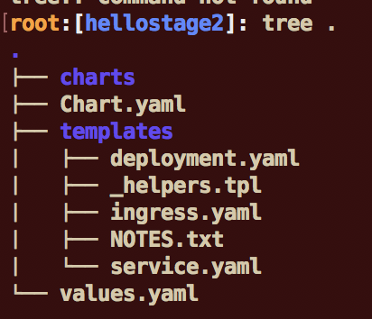

<div style="background-color:black;color:white; vertical-align: middle; text-align:center;font-size:250%; padding:10px; margin-top:100px"><b>
IBM Cloud Private - Helm Lab
 </b></a></div>

---


# Helm Lab

During this lab, we are going to install a helm client and configure it. Then we are going to install several sample charts to see how it works.

Helm helps you manage Kubernetes applications — Helm Charts helps you define, install, and upgrade even the most complex Kubernetes application.

Charts are easy to create, version, share, and publish — so start using Helm and stop the copy-and-paste madness.


Table of Contents

---

[[toc]]

---


# Task 1: Helm Setup


## 1. Connect as root to the **Ubuntu VM** using SSH or Putty 

Be sure that you are connected to cluster. Use the kubectl command to check that you are connected:

`kubectl get nodes`


If you get an error, go back to the installation lab and copy&paste the 5 lines from the console into the console.


## 2. Install helm tool

Helm is a client/server application : Helm client and Tiller server. 
Before we can run any chart with helm, we should proceed to some installation and change. 
   
## 3. Get the certificates

Use the following command to get the certificates: 

```console
curl -sL https://raw.githubusercontent.com/kubernetes/helm/master/scripts/get | bash
```

## 4. Download the Helm client from the master

```console
wget https://mycluster.icp:8443//helm-api/cli/linux-amd64/helm --no-check-certificate
```

This command will download the helm file to current directory.

## 5. Copy helm to /usr/local/bin

```
chmod +x helm

mv ./helm /usr/local/bin/helm
```
   

## 6. Configure the Cluster to set up Helm

These 2 commands will first login to ICP cluster and then it will  configure your cluster. cert.pem and key.pem certificates are added to the ~/.helm directory.


```console
bx pr login -a https://159.122.2.109:8443 --skip-ssl-validation
```

Results:
```console
root:[~]: bx pr login -a https://159.122.2.109:8443 --skip-ssl-validation
API endpoint: https://159.122.2.109:8443

Username> admin

Password> 
Authenticating...
OK

Select an account:
1. mycluster Account (id-mycluster-account)
Enter a number> 1
Targeted account: mycluster Account (id-mycluster-account)
```


`bx pr cluster-config mycluster`

Results:
```console
root:[~]: bx pr cluster-config mycluster
Configuring kubectl: /root/.bluemix/plugins/icp/clusters/mycluster/kube-config
Cluster "mycluster" set.
Cluster "mycluster" set.
User "mycluster-user" set.
Context "mycluster-context" modified.
Context "mycluster-context" modified.
Switched to context "mycluster-context".

OK
Cluster mycluster configured successfully.
```


## 7. Initialise Helm

`helm init --client-only`

Results:
```console
root:[~]: helm init --client-only
$HELM_HOME has been configured at /root/.helm.
Not installing Tiller due to 'client-only' flag having been set
Happy Helming!
```

After you have initialize helm client. Try the following command to see the version:

`helm version --tls`

> Note: some commands are using the **--tls** parameter for security (tls protocol) reason when there is an interaction between the Helm client and the Tiller server. 

If the client and the tiller versions are different then do the following :
- upgrade tiller if its version is lower compared to the client

`helm init --upgrade`

- or downgrade the tiller version instead (yes this is a "--force-upgrate" to **downgrade** tiller)

`helm init --upgrade --force-upgrade`

Then retry :
`helm version --tls`

You should get the following result:
```
root:[Lab 2]: helm version --tls
Client: &version.Version{SemVer:"v2.7.2+icp", GitCommit:"d41a5c2da480efc555ddca57d3972bcad3351801", GitTreeState:"dirty"}
Server: &version.Version{SemVer:"v2.7.2", GitCommit:"8478fb4fc723885b155c924d1c8c410b7a9444e6", GitTreeState:"clean"}
```

## 8. Access to the ICP container registry

For the next exercise, we need to get access to the IBM Cloud Private Registry. To do so,  login to the private registry:

`docker login mycluster.icp:8500 -u admin -p admin`


# Task 2: Installing a simple application


## 1. Getting a new helm repo

Add a Helm repository. To add the Kubernetes Incubator repository, run the following command:

```console
helm repo add incubator https://kubernetes-charts-incubator.storage.googleapis.com/
```

## 2. View the available packages

`helm search -l`

You should see a very long list of packages.

## 3. Install a package

In this command, package_name is the name for the package, and package_in_repo is the name of the available package to install. For example, to install the WordPress package, run the following command:

`helm install --name=my-wordpress stable/wordpress --tls`


## 4. List the package


`helm list --tls`

```
 NAME                REVISION    UPDATED                     STATUS      CHART              NAMESPACE
 my-wordpress        1           Wed Jun 28 22:15:13 2017    DEPLOYED    wordpress-0.6.5    default
 ```
 
## 5. Delete the package

`helm delete my-wordpress --purge --tls`

```
root:[Lab 2]: helm delete my-wordpress --purge --tls
release "my-wordpress" deleted
```

Generally an helm chart is managing many pods, deployments, images, secrets, volumes and services. So deleting the chart is a quick way to clean up your work.

# Task 3: Understand the Kubernetes manifests


## 1. Build the docker image for the demo

Move to the Lab 2 directory: 

`cd "/root/container-service-getting-started-wt/Lab 2"`


Then build the container:		

`docker build -t mycluster.icp:8500/default/hello-world:2 .`

`docker images mycluster.icp:8500/default/hello-world`

Result:


## 2. View the image in the console:

	- Select **Menu > Catalog > Images**
	- Click on the `default/hello-world`
	- Check version 2 is in the Tags


## 3. View a kubernetes manifest

Open the **healthcheck.yml** file

`nano healthcheck.yml`

- Indicates that the symbol `---` indicates a delimiter for a new resource
- Note that there are 2 resources being deployed here, a deployment and a service.
- The metadata section defines the attributes of the resource (name, annotation, label etc), while the spec specifies the detail of the resource

Review the deployment's manifest

```console
apiVersion: apps/v1beta1
kind: Deployment
metadata:
  name: hw-demo-deployment
spec:
  replicas: 3
  template:
    metadata:
      name: pod-liveness-http
      labels:
        run: hw-demo-health
        test: hello-world-demo
    spec:
      containers:
        - name: hw-demo-container
          image: "registry.ng.bluemix.net/<namespace>/hello-world:2"
          imagePullPolicy: Always
          livenessProbe:
            httpGet:
              path: /healthz
              port: 8080
            initialDelaySeconds: 5
            periodSeconds: 5
```

- Look into the deployment and see that the spec contains a ReplicaSet (see the `replicas` term) and that the ReplicaSet includes a Pod
- The Pod is defined as a template that contains the similar structure of metadata and specification
- The specification of the pod includes an array of containers that refers to an image.
- The livenessProbe and readinessProbe are checks that the kubernetes system would perform to check pod's health.

Review the **service's manifest**

```
apiVersion: v1
kind: Service
metadata:
  name: hw-demo-service
  labels:
    run: hw-demo-health
spec:
  type: NodePort
  selector:
    run: hw-demo-health
  ports:
   - protocol: TCP
     port: 8080
     nodePort: 30072
````

- The services defines the accessability of a pod. This service is of type NodePort, which exposes an internal Port (8080) into an externally accessible nodePort through the proxy node (here port 30072)
- How does a service know which pod are associated with it?  From the selector(s) that would select all pods with the same label(s) to be load balanced.

# Task 3: Define a Helm chart

Now that you have understood the structure of a kubernetes manifest file, you can start working with helm chart. Basically a helm chart is a collection of manifest files that are deployed as a group. The deployment includes the ability to perform variable substitution based on a configuration file.

## 1. Initialize an empty chart directory

`cd`

`helm create hellonginx`
        
## 2. Look at the chart directory content.
       
`cd hellonginx`

`tree .`





`nano values.yaml`

Look at **values.yaml** and **modify it**. Prepare to deploy **3** replicas of the nginx image. Replace the service section and choose a port (like 30073 for instance) with the following code:

```console
  name: hellonginx-service
  type: NodePort
  externalPort: 80  
  internalPort: 80  
  nodePort: 30073
```


The main content for **values.yaml** is as follows:

```
# Default values for hellonginx.
# This is a YAML-formatted file.
# Declare variables to be passed into your templates.

replicaCount: 1

image:
  repository: nginx
  tag: stable
  pullPolicy: IfNotPresent

service:
  name: hellonginx-service
  type: NodePort
  externalPort: 80  
  internalPort: 80  
  nodePort: 30073

ingress:
  enabled: false
  annotations: {}
    # kubernetes.io/ingress.class: nginx
    # kubernetes.io/tls-acme: "true"
  path: /
  hosts:
    - chart-example.local
  tls: []
  #  - secretName: chart-example-tls
  #    hosts:
  #      - chart-example.local

resources: {}
  # We usually recommend not to specify default resources and to leave this as a conscious
  # choice for the user. This also increases chances charts run on environments with little
  # resources, such as Minikube. If you do want to specify resources, uncomment the following
  # lines, adjust them as necessary, and remove the curly braces after 'resources:'.
  # limits:
  #  cpu: 100m
  #  memory: 128Mi
  # requests:
  #  cpu: 100m
  #  memory: 128Mi

nodeSelector: {}

tolerations: []

affinity: {}
````


Review deployment template: 

`nano /root/hellonginx/templates/deployment.yaml`

Don't change anything.

```
apiVersion: apps/v1beta2
kind: Deployment
metadata:
  name: {{ template "hellonginx.fullname" . }}
  labels:
    app: {{ template "hellonginx.name" . }}
    chart: {{ template "hellonginx.chart" . }}
    release: {{ .Release.Name }}
    heritage: {{ .Release.Service }}
spec:
  replicas: {{ .Values.replicaCount }}
  selector:
    matchLabels:
      app: {{ template "hellonginx.name" . }}
      release: {{ .Release.Name }}
  template:
    metadata:
      labels:
        app: {{ template "hellonginx.name" . }}
        release: {{ .Release.Name }}
    spec:
      containers:
        - name: {{ .Chart.Name }}
          image: "{{ .Values.image.repository }}:{{ .Values.image.tag }}"
          imagePullPolicy: {{ .Values.image.pullPolicy }}
          ports:
            - name: http
              containerPort: 80
              protocol: TCP
          livenessProbe:
            httpGet:
              path: /
              port: http
          readinessProbe:
            httpGet:
              path: /
              port: http
          resources:
{{ toYaml .Values.resources | indent 12 }}
    {{- with .Values.nodeSelector }}
      nodeSelector:
{{ toYaml . | indent 8 }}
    {{- end }}
    {{- with .Values.affinity }}
      affinity:
{{ toYaml . | indent 8 }}
    {{- end }}
    {{- with .Values.tolerations }}
      tolerations:
{{ toYaml . | indent 8 }}
    {{- end }}
```


Review the **service template**: 

`nano /root/hellonginx/templates/service.yaml`

Change the **-port section** with the following code:

```console
    - port: {{ .Values.service.externalPort }}
      targetPort: {{ .Values.service.internalPort }}
      protocol: TCP
      nodePort: {{ .Values.service.nodePort }}
      name: {{ .Values.service.name }}
```

So the service should look as follows:

```
apiVersion: v1
kind: Service
metadata:
  name: {{ template "fullname" . }}
  labels:
    app: {{ template "name" . }}
    chart: {{ .Chart.Name }}-{{ .Chart.Version | replace "+" "_" }}
    release: {{ .Release.Name }}
    heritage: {{ .Release.Service }}
spec:
  type: {{ .Values.service.type }}
  ports:
    - port: {{ .Values.service.externalPort }}
      targetPort: {{ .Values.service.internalPort }}
      protocol: TCP
      nodePort: {{ .Values.service.nodePort }}
      name: {{ .Values.service.name }}
  selector:
    app: {{ template "name" . }}
    release: {{ .Release.Name }}
```
## 3. Check the chart

Go back to the hellonginx path and check the validity of the helm chart.

`cd ..`

`helm lint`


# Task 4: Using Helm

The helm chart that we created in the previous section that has been verified now can be deployed.

## 1. Create a new namespace in ICP:

- Open a  Web browser from the application launcher
- Go to `https://mycluster.icp:8443/`
- Login as `admin` with the password of `admin`
- Go to **Menu > Manage**

  - Select __Namespaces__ then click __New namespace__<br>


  - Specify the namespace of `training` and click __Add namespace__.<br>


## 2. Install the chart to the training namespace

Type the following command and don't forget the dot at the end:

`helm install --name hellonginx --namespace training --tls .`

Results:
```console
root:[hellonginx]: helm install --name hellonginx --namespace training --tls .
NAME:   hellonginx
LAST DEPLOYED: Thu Apr 19 23:49:47 2018
NAMESPACE: training
STATUS: DEPLOYED

RESOURCES:
==> v1beta2/Deployment
NAME        DESIRED  CURRENT  UP-TO-DATE  AVAILABLE  AGE
hellonginx  1        1        1           0          0s

==> v1/Service
NAME        TYPE      CLUSTER-IP  EXTERNAL-IP  PORT(S)       AGE
hellonginx  NodePort  10.0.0.131  <none>       80:30073/TCP  0s


NOTES:
1. Get the application URL by running these commands:
  export NODE_PORT=$(kubectl get --namespace training -o jsonpath="{.spec.ports[0].nodePort}" services hellonginx)
  export NODE_IP=$(kubectl get nodes --namespace training -o jsonpath="{.items[0].status.addresses[0].address}")
  echo http://$NODE_IP:$NODE_PORT
```
At the end of the answer, copy & paste the last 3 lines:

```console
root:[hellonginx]:   export NODE_PORT=$(kubectl get --namespace training -o jsonpath="{.spec.ports[0].nodePort}" services hellonginx)
root:[hellonginx]:   export NODE_IP=$(kubectl get nodes --namespace training -o jsonpath="{.items[0].status.addresses[0].address}")
root:[hellonginx]:   echo http://$NODE_IP:$NODE_PORT
http://1192.168.225.132:30073
```
So that you should see the url:
`http://159.122.2.109:30073`

Try this url and get the nginx hello:


## 3. List the releases 

`helm list --tls`

Results:

```console
root:[hellonginx]: helm list --tls
NAME      	REVISION	UPDATED                 	STATUS  	CHART                	NAMESPACE
hellonginx	1       	Thu Apr 19 23:49:47 2018	DEPLOYED	hellonginx-0.1.0     	training 
my-release	1       	Tue Apr 17 20:08:44 2018	DEPLOYED	ibm-jenkins-dev-1.0.0	default  
```


## 4. List the deployments

`kubectl get deployments --namespace=training`

```console
root:[hellonginx]: kubectl get deployments --namespace=training
NAME         DESIRED   CURRENT   UP-TO-DATE   AVAILABLE   AGE
hellonginx   1         1         1            1           9m
```

## 5. List the services

`kubectl get services --namespace=training`

```console
root:[hellonginx]: kubectl get services --namespace=training
NAME         TYPE       CLUSTER-IP   EXTERNAL-IP   PORT(S)        AGE
hellonginx   NodePort   10.0.0.131   <none>        80:30073/TCP   10m
```

Locate the line port 80:300073.  

## 6. List the pods

`kubectl get pods --namespace=training`

**Results**

```console
root:[hellonginx]: kubectl get pods --namespace=training
NAME                          READY     STATUS    RESTARTS   AGE
hellonginx-6bcd9f4578-zqt6r   1/1       Running   0          11m
```

## 7. Upgrade 

We now want to change the number of replicas to 3:

`helm  upgrade hellonginx . --tls`

**Results**
```console
root:[hellonginx]: helm  upgrade hellonginx . --tls
Release "hellonginx" has been upgraded. Happy Helming!
LAST DEPLOYED: Fri Apr 20 00:06:55 2018
NAMESPACE: training
STATUS: DEPLOYED

RESOURCES:
==> v1/Service
NAME        TYPE      CLUSTER-IP  EXTERNAL-IP  PORT(S)       AGE
hellonginx  NodePort  10.0.0.131  <none>       80:30073/TCP  17m

==> v1beta2/Deployment
NAME        DESIRED  CURRENT  UP-TO-DATE  AVAILABLE  AGE
hellonginx  3        3        3           1          17m


NOTES:
1. Get the application URL by running these commands:
  export NODE_PORT=$(kubectl get --namespace training -o jsonpath="{.spec.ports[0].nodePort}" services hellonginx)
  export NODE_IP=$(kubectl get nodes --namespace training -o jsonpath="{.items[0].status.addresses[0].address}")
  echo http://$NODE_IP:$NODE_PORT

```


# Task 5: Defining the chart in the catalog

A good idea is to define the chart in the catalog.

First, package the helm chart as a tgz file:

`cd`

`helm package hellonginx`

**Results**
```console
root:[~]: helm package hellonginx
Successfully packaged chart and saved it to: /root/hellonginx-0.1.0.tgz
````

**Login**to the master:

`bx pr login -a https://159.122.2.109:8443 --skip-ssl-validation`

Then, use the "bx pr" command to load the chart:

`bx pr load-helm-chart --archive /root/hellonginx-0.1.0.tgz`

**Results**
```console
root:[~]: bx pr load-helm-chart --archive /root/hellonginx-0.1.0.tgz
Loading helm chart
  {"url":"https://icp-management-ingress:8443/helm-repo/charts/index.yaml"}
OK

Synch charts
  {"message":"synch started"}
OK
```


Leave the terminal and login to the ICP console with admin/admin :

- Select __Menu > Catalog__

- Find the `hellonginx` chart from AppCenter


- Click on the `hello` chart to get access to configuration.


- Click configure to see the parameters: 


Click **Install** to see the results. 

Of course, you can customize the README.MD and add an icon to make the chart more appealing. 

# Congratulations

You successfully create and manage charts to deploy applications on the IBM Cloud Private. 


---

<div style="background-color:black;color:white; vertical-align: middle; text-align:center;font-size:250%; padding:10px; margin-top:100px"><b>
IBM Cloud Private - Helm Lab
 </b></a></div>
