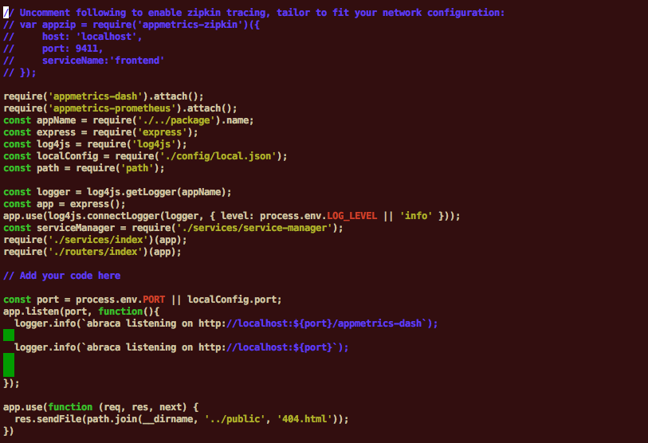
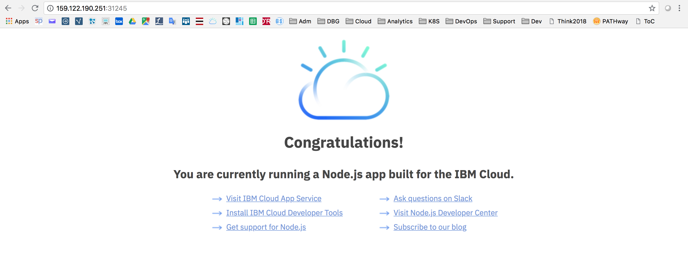

<div style="background-color:black;color:white; vertical-align: middle; text-align:center;font-size:250%; padding:10px; margin-top:100px"><b>
IBM Cloud Private - Microservice Builder Lab
 </b></a></div>


---
# Microservice Builder Lab
---


---


In this tutorial, you create, install and run a cloud-native microservice application on an IBM® Cloud Private platform on Kubernetes.

Microservice Builder will guide you thru the tree creation of complete project including all the directories, the manifest files, the monitoring option that you need for a perfect application.

## Table of Contents

---

- [Cloud-Native Microservice Builder Lab](#cloud-native-microservice-builder-lab)
- [Task 1: Access the IBM Cloud Private console](#task-1--access-the-ibm-cloud-private-console)
- [Task 2: Use the Microservice Builder](#task-2--use-the-microservice-builder)
  * [1. Create your project](#1-create-your-project)
  * [2. Build your project](#2-build-your-project)
  * [3. Push the container](#3-push-the-container)
- [Task 3: Install the application](#task-3--install-the-application)
- [Congratulations](#congratulations)


---


# Task 1: Access the IBM Cloud Private console


From a machine that is hosting your environment, open a web browser and go to one of the following URLs to access the IBM Cloud Private management console:
  - Open a browser
  - go to https://mycluster.icp:8443
  - Login to ICP console with admin / admin


On the terminal, connect on the Ubuntu VM using SSH or Putty.

Check the the ibmcloud dev command is working:

`ibmcloud dev`

**Results**
```console
# ibmcloud dev
NAME:
   ibmcloud dev - A CLI plugin to create, manage, and run projects on IBM Cloud

USAGE:
   ibmcloud dev command [arguments...] [command options]

VERSION:
   1.3.3

COMMANDS:
   build             Build the project in a local container
   code              Download the code from a project
   console           Opens the IBM Cloud console for a project
   create            Creates a new project and gives you the option to add services
   debug             Debug your application in a local container
   delete            Deletes a project from your space
   deploy            Deploy an application to IBM Cloud
   enable            Add IBM Cloud files to an existing project.
   get-credentials   Gets credentials required by the project to enable use of bound services.
   list              List all IBM Cloud projects in a space
   run               Run your application in a local container
   shell             Open a shell into a local container
   status            Check the status of the containers used by the CLI
   stop              Stop a container
   test              Test your application in a local container
   view              View the URL of your project
   help              Show help
```

If this command doesn't show, then go to the end of the ICP Installation Lab and install that command.


# Task 2: Use the Microservice Builder


Application workloads can be deployed to run on an IBM Cloud Private cluster. The deployment of an application workload must be made available as a Helm package. Such packages must either be made available for deployment on a Helm repository, or loaded into an IBM Cloud Private internal Helm repository.

### 1. Create your project

`ibmcloud dev create`

Follow the instructions:

---
Log in to IBM Cloud using the ibmcloud login command to synchronize your projects with the IBM Cloud dashboard, and to enable the use of IBM Cloud services in your project.
? Do you wish to continue without logging in? [y/n]> **y**
? Select a resource type:                  
1. Backend Service / Web App
2. Mobile Client
Enter a number> **1**

? Select a language:
1. Java - MicroProfile / Java EE
2. Java - Spring
3. Node
4. Python - Django
5. Python - Flask
6. Swift
Enter a number> **3**

? Select a Starter Kit or select the last option for more information:
1. Backend for Frontend - Express.js Backend
2. Microservice - Express.js Microservice
3. Web App - Create Project
4. Web App - Express.js Basic
5. Web App - Express.js React
6. Web App - MongoDb + Express + Angular + Node
7. Web App - MongoDb + Express + React + Node
8. Show more details
Enter a number> **3**

? Enter a name for your application> **abraca**
Using the resource group default (default) of your account
? Do you want to add services to your application? [y/n]> **n**

? Select from the following DevOps Toolchain and target runtime environment options:
Note: If you choose to create a DevOps Toolchain, then this machine must be
      configured for SSH access to your IBM Cloud Git Lab account at
      https://git.eu-gb.bluemix.net/profile/keys in order to download the
      application code.
1. IBM DevOps, using Cloud Foundry buildpacks
2. IBM DevOps, using Kubernetes containers
3. No DevOps, with manual deployment
Enter a number> **3**
The application, **abraca**, has been successfully saved into the current directory.
---


Visualize your project. You can notice  that files and directories have been created for you.

```console
# ls abraca
chart           Dockerfile        Jenkinsfile  manifest.yml  public     run-debug  server
cli-config.yml  Dockerfile-tools  LICENSE      package.json  README.md  run-dev    test
root:[~]:
```

You can notice that a lot of things have been created for you like :
- **Dockerfile** for dockerization of the application
- Dockerfile-tools
- **Jenkinsfile** to help deploying the application with Jenkins
- **manifest.yml** file for deploying in Cloud Foundry
- **server** directory containing the application (**server.js**)
- helm charts (in chart directory)
- debugging options
- lot of predefined directories, files and codes in the application

Have a look at the following peace of code :

`nano /root/abraca/server/server.js`



In that node.js program, you can also notice that we already have predefined libraries and codes :
- appmetrics (metrics collection)
- log4js
- express
- logger


### 2. Build your project

`cd abraca`

`ibmcloud dev build`

**Results**
```console
# cd abraca/
# ibmcloud dev build
Creating image abraca-express-tools based on Dockerfile-tools...
OK                    
Creating a container named 'abraca-express-tools' from that image...
OK
Starting the 'abraca-express-tools' container...
OK
Building the project in the current directory started at Tue Apr 17 21:34:16 2018
OK                    
Stopping the 'abraca-express-tools' container...
OK
```

A new container (abraca-express-tools) has been created.

`docker images abraca-express-tools`

Results:
```console
# docker images abraca-express-tools
REPOSITORY             TAG                 IMAGE ID            CREATED             SIZE
abraca-express-tools   latest              e3072a821f87        3 minutes ago       483MB
```

### 3. Modify your project to access ICP

Login to the container registry in the cluster
`docker login mycluster.icp:8500`

**Results**
```console
# docker login mycluster.icp:8500
Username (admin): admin
Password:
Login Succeeded
```

Next, you’ll configure the service account in IBM Cloud Private with the image pull secret.  This enables Kubernetes to pull images from the private registry.  

This technique uses jq, which has been installed using apt (Ubuntu Linux) in the Installation Lab.

Type the following command to configure your serviceaccounts :
```
kubectl get serviceaccounts default -o json |
jq  'del(.metadata.resourceVersion)'|
jq 'setpath(["imagePullSecrets"];[{"name":"admin.registrykey"}])' |
kubectl replace serviceaccount default -f -
```

Where “admin” is your user account associated with the namespace to which you will be deploying, and that you have used to login to IBM Cloud Private, previously.  Upon completion of jq, you will see an entry for the serviceaccount is noted as “replaced.”

For the simplest deploy experience, you can update your application’s cli-config.yml file to point to the IBM Cloud Private Kubernetes environment by adding these entries:

```
deploy-target: "container"
deploy-image-target: "mycluster.icp:8500/<Namespace>/<App-Name>"
```

The  `<Namespace>` is the namespace on IBM Cloud Private to which you are deploying, for example default. `<App-Name>` is the name of your application deployment.

In that case, we are going to edit the cli-config.yml :

`nano cli-config.yml`

Go the end of the file and **add** the following 2 lines :

```
deploy-target: "container"
deploy-image-target: "mycluster.icp:8500/default/abraca"
```
Save your file (ctrl+O, Enter, Crtl+X)


# Task 3: Install the application

You’re now ready to deploy your Kubernetes application to the IBM Cloud Private environment.  In this case, the deploy command will :

`cd /root/abraca/`


`ibmcloud dev deploy`

Results :

```
# ibmcloud dev deploy
Tag the Run image to the Docker registry as mycluster.icp:8500/default/abraca:0.0.1
Unable to tag the image abraca-express-run, will now attempt to build and tag it
OK
Push the Run image to the Docker registry
OK                   
Execute 'helm upgrade --tls'
OK
Pods:

NAME                                 READY     STATUS              RESTARTS   AGE
abraca-deployment-7fbf5d487d-btmf6   0/1       ContainerCreating   0          0s

Deployments:

NAME                DESIRED   CURRENT   UP-TO-DATE   AVAILABLE   AGE
abraca-deployment   1         1         1            0           0s

Services:

NAME                  TYPE        CLUSTER-IP   EXTERNAL-IP   PORT(S)          AGE
abraca-service        NodePort    10.0.0.236   <none>        3000:31245/TCP   1s


Nodes:

NAME              STATUS    ROLES     AGE       VERSION
159.122.190.251   Ready     <none>    1d        v1.10.0+icp

Untag the Run image from the Docker registry
OK
Your app is hosted at http://159.122.190.252:31245/
```


This deploy command build and upload the Docker image of your application to the IBM Cloud Private image repository
This performs a deployment to your IBM Cloud Private Kubernetes cluster using the Helm chart that was generated by the **ibmcloud dev create** or **ibmcloud dev enable** command.
…and now you have generated and deployed your first application to IBM Cloud Private using the IBM Cloud Developer Tools CLI.

Go the ICP management console and check the Helm Release and all the Kubernetes components.

Try the URL : `http://ipaddress:31245` from a browser.




# Congratulations

You have successfully created and installed a microservice application with Microservice Builder.

----


<div style="background-color:black;color:white; vertical-align: middle; text-align:center;font-size:250%; padding:10px; margin-top:100px"><b>
IBM Cloud Private - Microservice Builder Lab
 </b></a></div>
