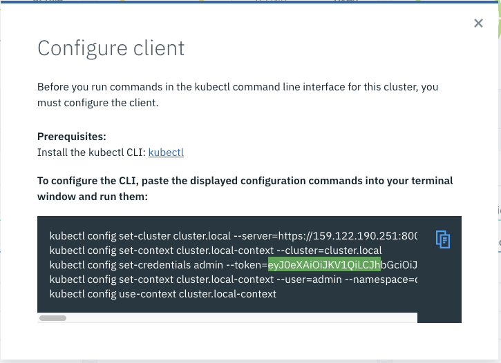
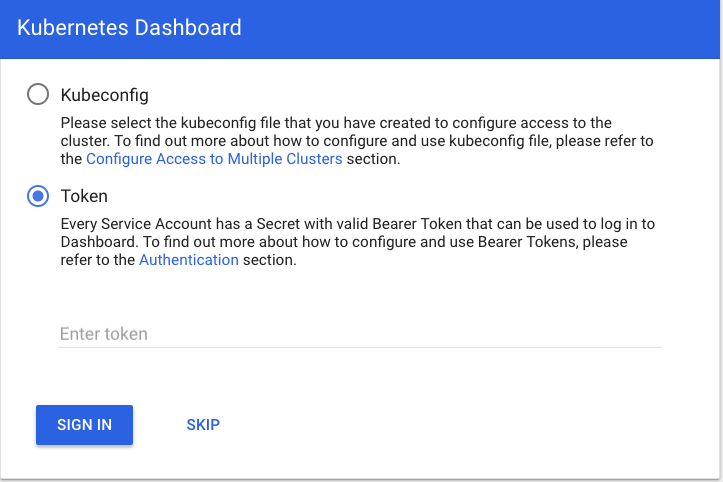
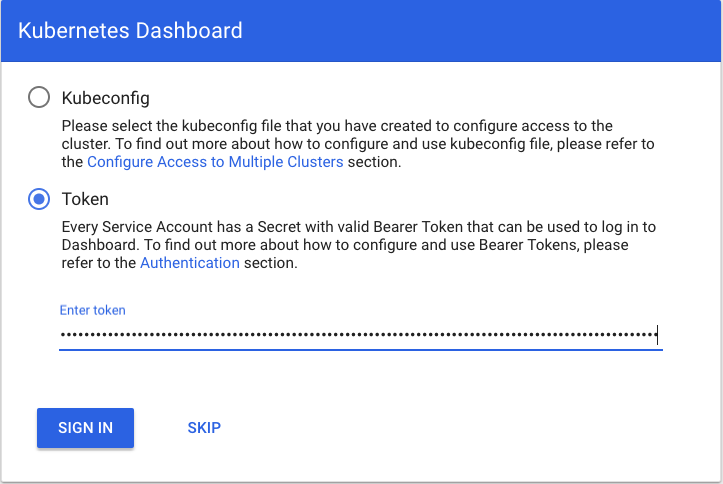
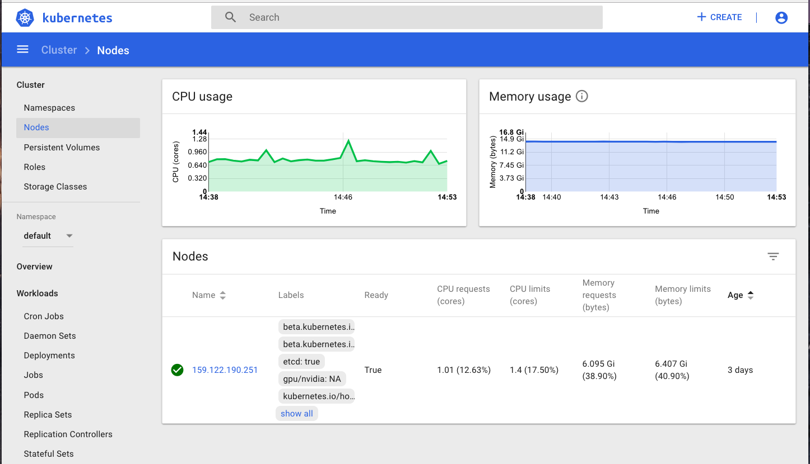
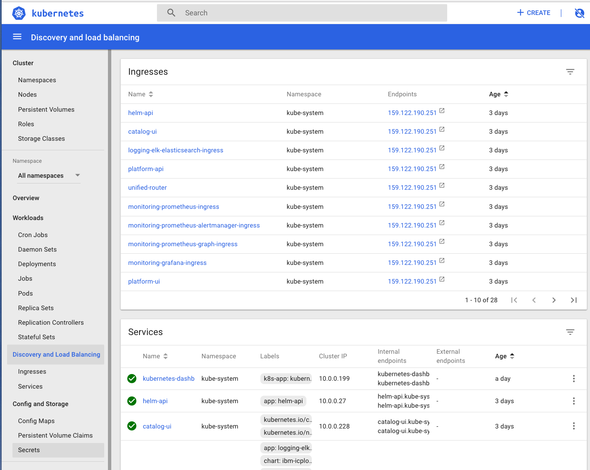

<div style="background-color:black;color:white; vertical-align: middle; text-align:center;font-size:250%; padding:10px; margin-top:100px"><b>
IBM Cloud Private - Dashboard Lab
 </b></a></div>

---
# Dashboard Lab
---


**Kubernetes Dashboard** is a general purpose, web-based UI for Kubernetes clusters. It allows users to manage applications running in the cluster and troubleshoot them, as well as manage the cluster itself.

The purpose of this lab is to install the dashboard in the IBM Cloud Private Cluster that we already created. 

> **Prerequisites** : you should be logged on your VM and connected to your ICP master.


## Table of Contents

---
- [Task 1: Download the manifest file](#task-1--download-the-manifest-file)
- [Task 2: Modify the manifest file](#task-2--modify-the-manifest-file)
- [Task 3: Deploy the Dashboard](#task-3--deploy-the-dashboard)
- [Task 4: Connect to the Dashboard](#task-4--connect-to-the-dashboard)
- [Task 6: Navigate in the Dashboard](#task-6--navigate-in-the-dashboard)
- [Congratulations](#congratulations)
---
 
 
# Task 1: Download the manifest file

To get the latest version of the Kubernetes Dashboard, you can get it on the following link :

https://github.com/kubernetes/dashboard

And then the deployment file can be found at :

```console 
wget https://raw.githubusercontent.com/kubernetes/dashboard/master/src/deploy/recommended/kubernetes-dashboard.yaml
```

 
# Task 2: Modify the manifest file

Edit the file you just downloaded :

`nano kubernetes-dashboard.yaml`

Then go to the **service section** and locate the **spec** :

```console
spec:
  ports:
    - port: 443
      targetPort: 8443
  selector:
    k8s-app: kubernetes-dashboard
```

Modify this section with the following code :

```console 
spec:
  type: NodePort
  ports:
    - protocol: TCP
      port: 443
      targetPort: 8443
      nodePort: 30100
  selector:
    k8s-app: kubernetes-dashboard
```

> Note that the choice of the nodePort 30100 is up to you. 

Save the file (Ctrl+o, enter, Ctrl+x).

# Task 3: Deploy the Dashboard

Check you are connected by typing the following command :

`kubectl get nodes` 

Results :

```console
# kubectl get nodes
NAME              STATUS    ROLES     AGE       VERSION
159.122.190.251   Ready     <none>    3d        v1.10.0+icp
```

Deploy the dashboard :

`kubectl create -f kubernetes-dashboard.yaml` 

Results :

```console 
# kubectl create -f dashboard.yml
secret "kubernetes-dashboard-certs" created
serviceaccount "kubernetes-dashboard" created
role.rbac.authorization.k8s.io "kubernetes-dashboard-minimal" created
rolebinding.rbac.authorization.k8s.io "kubernetes-dashboard-minimal" created
deployment.apps "kubernetes-dashboard" created
service "kubernetes-dashboard" created
```
Use the following command to check that the POD is running :

`kubectl get deploy kubernetes-dashboard -n kube-system`

Results :
```console
# kubectl get deploy kubernetes-dashboard -n kube-system
NAME                   DESIRED   CURRENT   UP-TO-DATE   AVAILABLE   AGE
kubernetes-dashboard   1         1         1            1           1d
```

# Task 4: Connect to the Dashboard

First step, you should get your **token** from the IBM Cloud Private console :
- go to your admin profile (top right hand)
- click on **configure client**



> Take a note (copy) of the very long string corresponding to the **admin token**.

Use the following URL to get connected to the Kubernetes Dashboard :

`https://ipaddress:30100`

The following screen should appear :



Click on token radio button and paste your **token**. 



The Kubernetes Dashboard should appear :



Alternate **Admin privileges**
> **IMPORTANT**: Make sure that you know what you are doing before proceeding. Granting admin privileges to Dashboard's Service Account might be a security risk.

You can grant full admin privileges to Dashboard's Service Account by creating below ClusterRoleBinding. Copy the YAML file based on chosen installation method and save as, i.e. dashboard-admin.yaml. Use kubectl create -f dashboard-admin.yaml to deploy it. Afterwards you can use Skip option on login page to access Dashboard.

`nano dashboard-admin.yaml`

```console
apiVersion: rbac.authorization.k8s.io/v1beta1
kind: ClusterRoleBinding
metadata:
  name: kubernetes-dashboard
  labels:
    k8s-app: kubernetes-dashboard
roleRef:
  apiGroup: rbac.authorization.k8s.io
  kind: ClusterRole
  name: cluster-admin
subjects:
- kind: ServiceAccount
  name: kubernetes-dashboard
  namespace: kube-system
```

Save the file (Ctrl+o, enter, Ctrl+x).

`kubectl create -f dashboard-admin.yaml`

Then open a new browser window and type :

`https://ipaddress:30100`

Click **skip** to get access to the Kubernetes Dashboard. 


# Task 6: Navigate in the Dashboard

Navigate on the left pane :
- Nodes
- Persistent volumes
- Namespace section, choose the **All Namespaces**
- Deployments
- Pods
- Discovery and Load Balancing





# Congratulations 

You have successfully installed, deployed and customized the Kubernetes Dashboard for an **IBM Cloud Private** cluster.


<div style="background-color:black;color:white; vertical-align: middle; text-align:center;font-size:250%; padding:10px; margin-top:100px"><b>
IBM Cloud Private - Dashboard Lab
 </b></a></div>
