<div style="background-color:black;color:white; vertical-align: middle; text-align:center;font-size:250%; padding:10px; margin-top:100px"><b>
IBM Cloud Private - Microclimate Lab
 </b></a></div>


---
# Microclimate Lab
---


---


In this tutorial, you create, install and run a cloud-native microservice application on an IBM® Cloud Private platform on Kubernetes.

Microclimate will guide you thru the creation of complete project including all the directories, the manifest files, the monitoring option that you need for a perfect application.

[Link to Microclimate documentation here](https://microclimate-dev2ops.github.io/)

## Table of Contents

---

---


# Task 1: Access the console and check Helm


From a machine that is hosting your environment, open a web browser and go to one of the following URLs to access the IBM Cloud Private management console:
  - Open a browser
  - go to https://mycluster.icp:8443
  - Login to ICP console with admin / admin


On the terminal, connect on the Ubuntu VM using SSH or Putty.

Check the helm command is working:

`helm version --tls`


# Task 2: Install Microclimate


Application workloads can be deployed to run on an IBM Cloud Private cluster. The deployment of an application workload must be made available as a Helm package. Such packages must either be made available for deployment on a Helm repository, or loaded into an IBM Cloud Private internal Helm repository.

## 1. Prepare the environment

There are several prerequisites:
- add persistent volumes
- Create a Docker registry secret for Microclimate
- Patch this secret to a service account.
- Ensure that the target namespace for deployments can access the docker image registry.
- Create a secret so Microclimate can securely use Helm.
- Set the Microclimate and Jenkins hostname values

### Add persistent volumes

Create a file with that command:

`nano pv-mc.yaml`

Copy and paste the following text in the file (this is a kubernetes document):

```console
apiVersion: v1
kind: PersistentVolume
metadata:
  name: hostpath-pv-rwo-mc1
spec:
  accessModes:
  - ReadWriteOnce
  capacity:
    storage: 10Gi
  hostPath:
    path: /tmp/data01
  persistentVolumeReclaimPolicy: Recycle
---
apiVersion: v1
kind: PersistentVolume
metadata:
  name: hostpath-pv-rwo-mc2
spec:
  accessModes:
  - ReadWriteOnce
  capacity:
    storage: 10Gi
  hostPath:
    path: /tmp/data01
  persistentVolumeReclaimPolicy: Recycle
---
apiVersion: v1
kind: PersistentVolume
metadata:
  name: hostpath-pv-rwm-mc1
spec:
  accessModes:
  - ReadWriteMany
  capacity:
    storage: 10Gi
  hostPath:
    path: /tmp/data01
  persistentVolumeReclaimPolicy: Recycle  
---
apiVersion: v1
kind: PersistentVolume
metadata:
  name: hostpath-pv-rwm-mc2
spec:
  accessModes:
  - ReadWriteMany
  capacity:
    storage: 10Gi
  hostPath:
    path: /tmp/data01
  persistentVolumeReclaimPolicy: Recycle  
```
Save the file (ctrl O, enter, ctrl X ).

And then use the following command:

`kubectl create  -f ./pv-mc.yaml`

Results:
```console
# kubectl create  -f ./pv-mc.yaml
persistentvolume "hostpath-pv-rwo-mc1" created
persistentvolume "hostpath-pv-rwo-mc2" created
persistentvolume "hostpath-pv-rwm-mc1" created
persistentvolume "hostpath-pv-rwm-mc2" created
```

Once created, these 4 volumes (hostpath) can be listed with the following command:

`kubectl get pv` 


Results:
```console
# kubectl get pv
NAME                          CAPACITY   ACCESS MODES   RECLAIM POLICY   STATUS      CLAIM                                       STORAGECLASS               REASON    AGE
helm-repo-pv                  5Gi        RWO            Delete           Bound       kube-system/helm-repo-pvc                   helm-repo-storage                    3h
hostpath-pv-many-test1        50Gi       RWX            Recycle          Available                                                                                    2h
hostpath-pv-once-test1        30Gi       RWO            Recycle          Available                                                                                    2h
hostpath-pv-rwm-mc1           10Gi       RWX            Recycle          Available                                                                                    1m
hostpath-pv-rwm-mc2           10Gi       RWX            Recycle          Available                                                                                    1m
hostpath-pv-rwo-mc1           10Gi       RWO            Recycle          Available                                                                                    1m
hostpath-pv-rwo-mc2           10Gi       RWO            Recycle          Available                                                                                    1m
image-manager-5.10.96.73      20Gi       RWO            Retain           Bound       kube-system/image-manager-image-manager-0   image-manager-storage                3h
logging-datanode-5.10.96.73   20Gi       RWO            Retain           Bound       kube-system/data-logging-elk-data-0         logging-storage-datanode             3h
mongodb-5.10.96.73            20Gi       RWO            Retain           Bound       kube-system/mongodbdir-icp-mongodb-0        mongodb-storage                      3h
```

### Create a Docker registry secret for Microclimate

``` 
kubectl create secret docker-registry microclimate-registry-secret \
  --docker-server=mycluster.icp:8500 \
  --docker-username=admin \
  --docker-password=admin \
  --docker-email=null
```

Results:
```console
# kubectl create secret docker-registry microclimate-registry-secret \
>   --docker-server=mycluster.icp:8500 \
>   --docker-username=admin \
>   --docker-password=admin \
>   --docker-email=null
secret "microclimate-registry-secret" created
```

### Patch this secret to a service account

`kubectl patch serviceaccount default -p '{"imagePullSecrets": [{"name": "microclimate-registry-secret"}]}'`

Results:
```console
# kubectl patch serviceaccount default -p '{"imagePullSecrets": [{"name": "microclimate-registry-secret"}]}'
serviceaccount "default" patched
```

### Ensure target namespace for deployments

The chart parameter jenkins.Pipeline.TargetNamespace defines the namespace that the pipeline deploys to. Its default value is "microclimate-pipeline-deployments". This namespace must be created before using the pipeline. Ensure that the default service account in this namespace has an associated image pull secret that permits pods in this namespace to pull images from the ICP image registry. For example, you might create another docker-registry secret and patch the service account:

```
kubectl create ns microclimate-pipeline-deployments

kubectl create secret docker-registry microclimate-registry-secret \
  --namespace=microclimate-pipeline-deployments \
  --docker-server=mycluster.icp:8500 \
  --docker-username=admin \
  --docker-password=admin \
  --docker-email=null

kubectl patch serviceaccount default -p '{"imagePullSecrets": [{"name": "microclimate-registry-secret"}]}' --namespace microclimate-pipeline-deployments
```

### Create a secret to use Tiller over TLS

Microclimate's pipeline deploys applications by using the Tiller at kube-system. Secure communication with this Tiller is required and must be configured by creating a Kubernetes secret that contains the required certificate files as detailed below.

To create the secret, use the following command replacing the values with where you saved your files:

```
kubectl create secret generic microclimate-helm-secret --from-file=cert.pem=.helm/cert.pem --from-file=ca.pem=.helm/ca.pem --from-file=key.pem=.helm/key.pem
```

Results:
```console 
# kubectl create secret generic microclimate-helm-secret --from-file=cert.pem=.helm/cert.pem --from-file=ca.pem=.helm/ca.pem --from-file=key.pem=.helm/key.pem
secret "microclimate-helm-secret" created
```


## 2. Install from the command line 

First define the **ibm-charts** helm repo (if not done in a previous exercise):
```
helm repo add ibm-charts https://raw.githubusercontent.com/IBM/charts/master/repo/stable/
```

Then install Microclimate:

```
helm install --name microclimate --set hostName=microclimate.<icp-proxy>.nip.io --set jenkins.Master.HostName=jenkins.<icp-proxy>.nip.io ibm-charts/ibm-microclimate --tls
```
> **VERY IMPORTANT** : Change **icp-proxy**  with the **ipaddress** of the ICP Cluster.
> It can take a few minutes before you can see the following results:

```console
NAME:   microclimate
LAST DEPLOYED: Sun Aug 26 17:39:17 2018
NAMESPACE: default
STATUS: DEPLOYED

RESOURCES:
==> v1/PersistentVolumeClaim
NAME                           STATUS  VOLUME               CAPACITY  ACCESS MODES  STORAGECLASS  AGE
microclimate-jenkins           Bound   hostpath-pv-rwo-mc2  10Gi      RWO           1m
microclimate-ibm-microclimate  Bound   hostpath-pv-rwm-mc1  10Gi      RWX           1m

==> v1/Service
NAME                                  TYPE       CLUSTER-IP  EXTERNAL-IP  PORT(S)                     AGE
microclimate-jenkins-agent            ClusterIP  10.0.0.4    <none>       50000/TCP                   1m
microclimate-jenkins                  ClusterIP  10.0.0.21   <none>       8080/TCP                    1m
microclimate-ibm-microclimate-devops  ClusterIP  10.0.0.252  <none>       9191/TCP                    1m
microclimate-ibm-microclimate         ClusterIP  10.0.0.15   <none>       4191/TCP,9090/TCP,9091/TCP  1m

==> v1beta1/Deployment
NAME                                  DESIRED  CURRENT  UP-TO-DATE  AVAILABLE  AGE
microclimate-jenkins                  1        1        1           0          1m
microclimate-ibm-microclimate-devops  1        1        1           0          1m
microclimate-ibm-microclimate         1        1        1           0          1m

==> v1beta1/Ingress
NAME                           HOSTS                           ADDRESS     PORTS    AGE
microclimate-jenkins           jenkins.5.10.96.73.nip.io       5.10.96.73  80, 443  1m
microclimate-ibm-microclimate  microclimate.5.10.96.73.nip.io  5.10.96.73  80, 443  1m

==> v1/Pod(related)
NAME                                                   READY  STATUS    RESTARTS  AGE
microclimate-jenkins-65754f89dd-zcnvt                  0/1    Init:0/1  0         1m
microclimate-ibm-microclimate-devops-5bb4f94f79-clgkg  0/1    Running   0         1m
microclimate-ibm-microclimate-5f985fd777-zh8zg         0/1    Running   0         1m

==> v1/Secret
NAME                           TYPE    DATA  AGE
microclimate-jenkins           Opaque  2     1m
microclimate-mc-tls-secret     Opaque  2     1m
microclimate-tls-secret        Opaque  2     1m
microclimate-ibm-microclimate  Opaque  3     1m

==> v1/ConfigMap
NAME                                                 DATA  AGE
microclimate-jenkins                                 6     1m
microclimate-jenkins-tests                           1     1m
microclimate-helmtest-devops                         1     1m
microclimate-ibm-microclimate-fixup-jenkins-ingress  1     1m


NOTES:
ibm-microclimate-1.5.0

1. Access the Microclimate portal at the following URL: https://microclimate.5.10.96.73.nip.io
```

Check that all deployments are ready (the available column should have a 1 on every row) :
`kubectl get deployment`

Results:
```console 
# kubectl get deployment
NAME                                   DESIRED   CURRENT   UP-TO-DATE   AVAILABLE   AGE
microclimate-ibm-microclimate          1         1         1            1           4m
microclimate-ibm-microclimate-devops   1         1         1            1           4m
microclimate-jenkins                   1         1         1            1           4m
``` 

Finally get access to the Microclimate portal with the following link in your browser:

`https://microclimate.<ipaddress>.nip.io`
(replace ipaddress with your icp ip address)

Accept the license agreement:

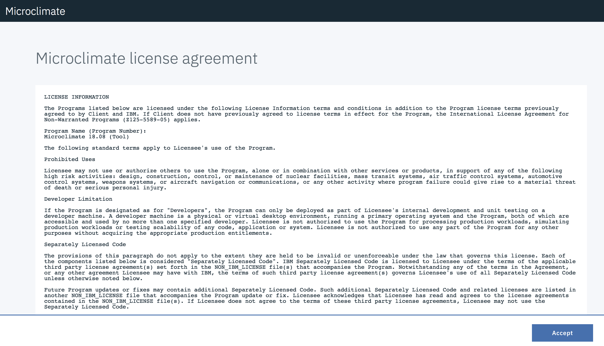

You should click on **Done** and then you are on the main menu:
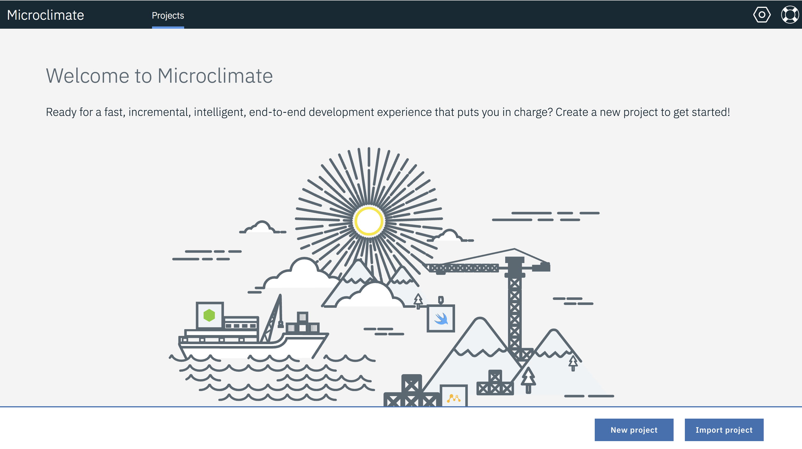

This concludes the Microclimate installation. 

> Note: this installation can also be done thru the ICP Catalog.


# Task 3: Install a simple application

You’re now ready to deploy your Kubernetes application to the IBM Cloud Private environment.  In this case, the deploy command will :


Click on **New project** button:


Choose Node (because we want to create a Node.js application) and type the name: **nodeone** and click **Next**

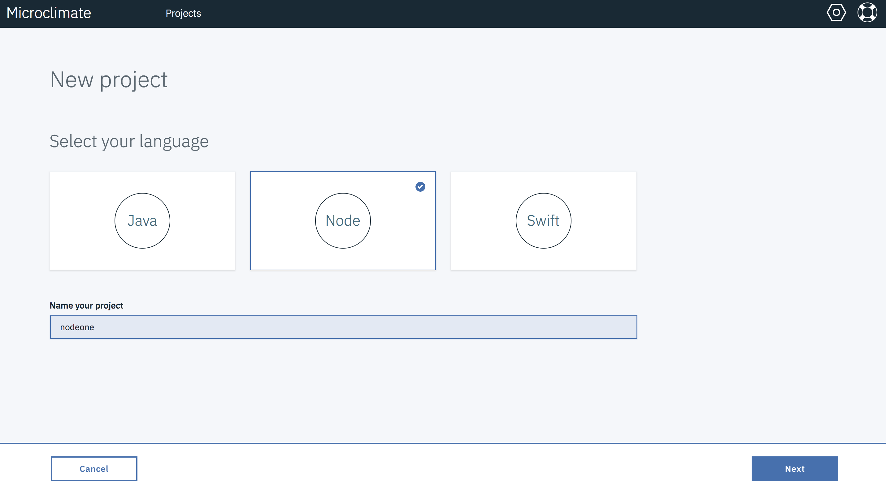

On the next menu, don't choose any service (but you can notice that we can bind a service to an application), then click on **Create**

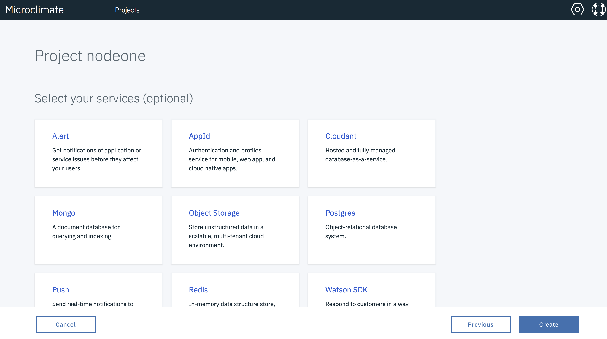

Be patient (it could take a few minutes). Your application should appear and the building process could still be running: 

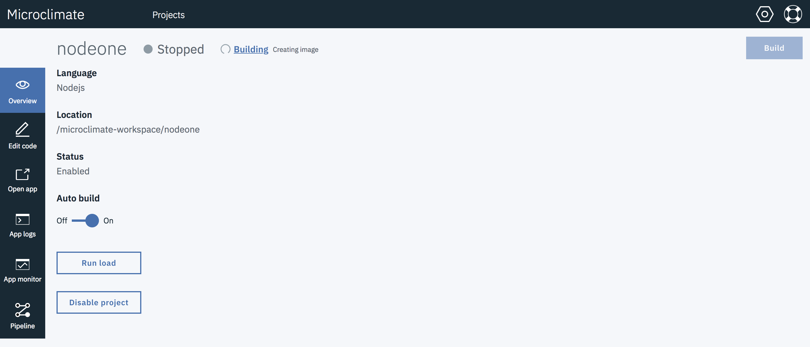

After a few minutes, the application should be running (check the green light):

![Building(./images/mcrunning.png)

To access the application, click on the **Open App** button on the left pane:

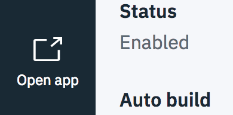

The application should appear:

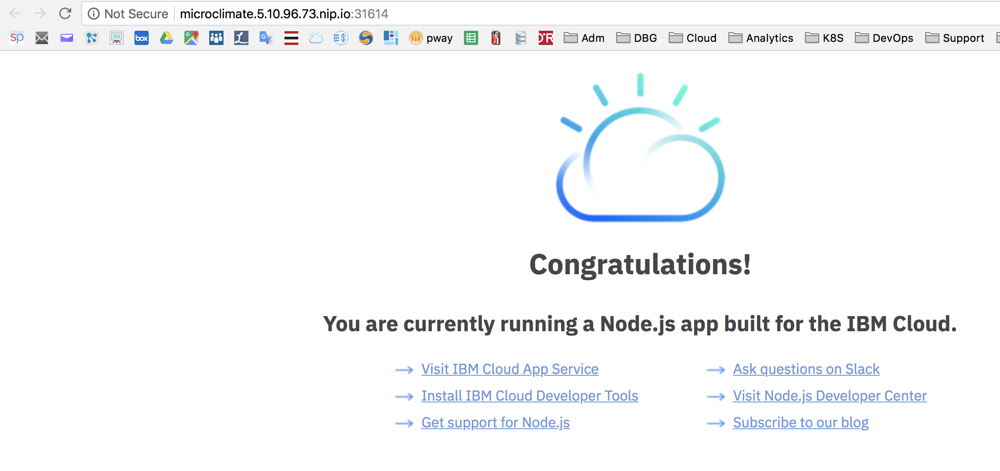


Navigate on the left pane to the **Edit** button:

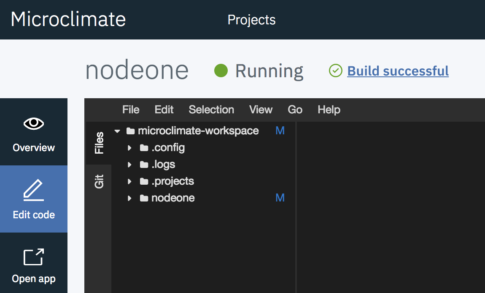

At this point, the editor can be used to edit the Node.JS application. 
Expand **nodeone>public>index.html**

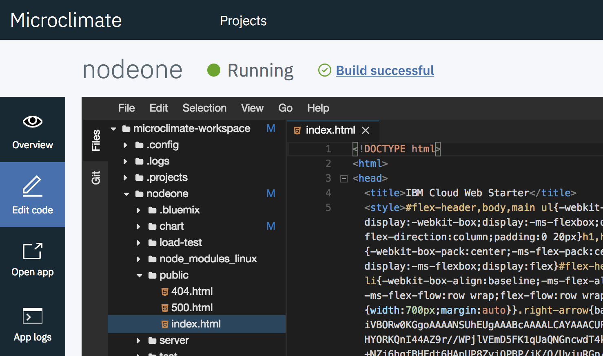

Go to the end of the index.html file and modify the **congratulation** line :

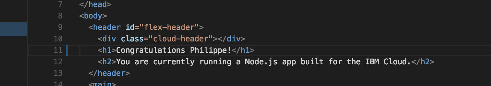

Then re-build the application:

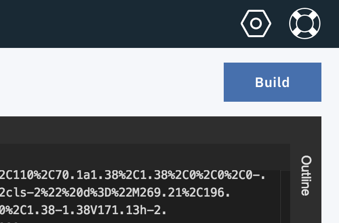

Wait until the green light to see the modification:

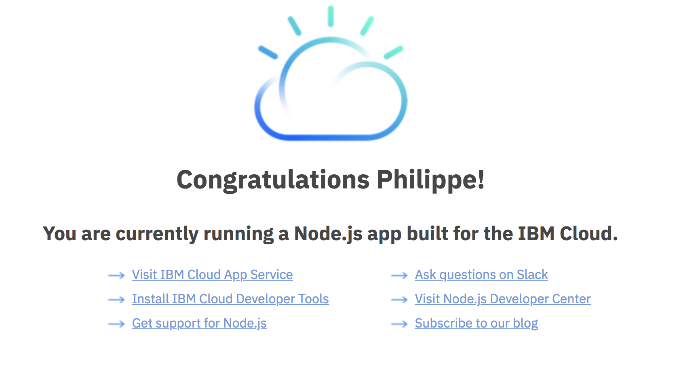

From the main menu of the application, click on **App Monitor** to see some metrics:

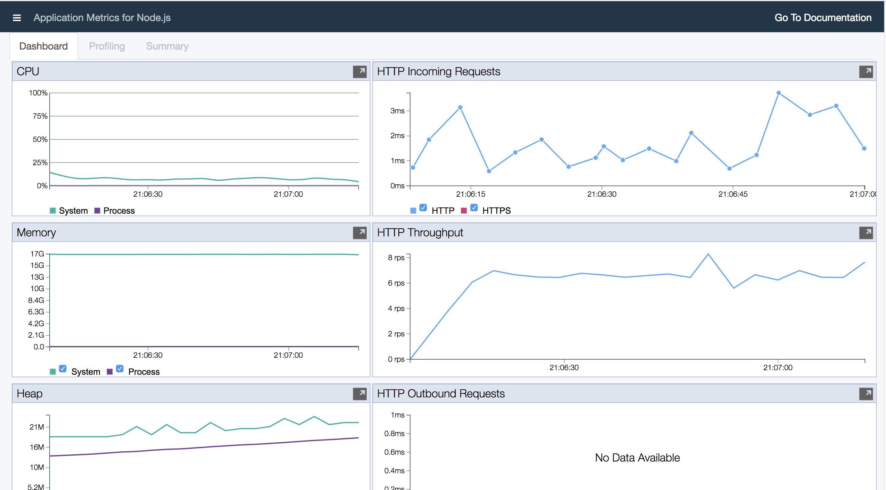


# Task 4: Import and deploy an application

To import a new application from Github, click on the **Project** button. Then choose **Import project**:

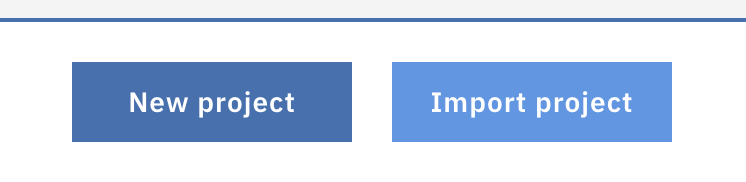

On the Import page, type `https://github.com/microclimate-demo/node` as the Git location :

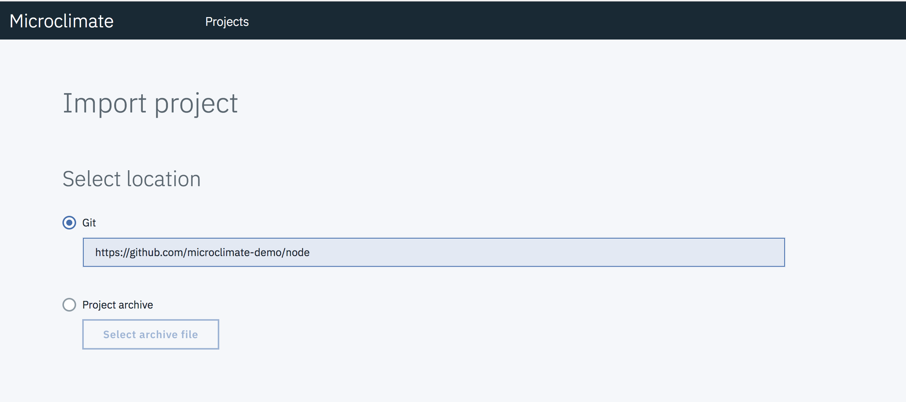

Enter a name : `nodetwo` and click **Finish**

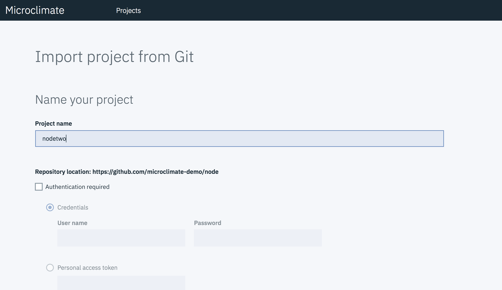

When the application is running : 

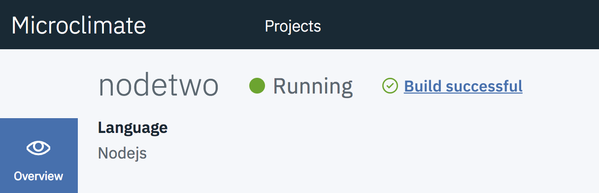

Click on **Open App**:

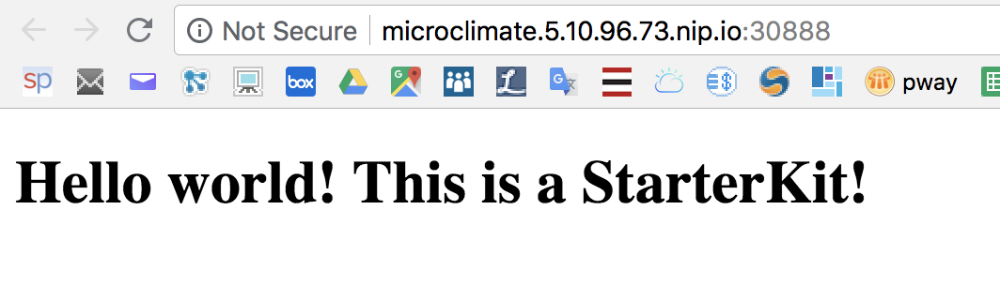


# Task 5: Use a pipeline

Goto the pipeline, type a pipeline name `node3`and a repository to get the application  `https://github.com/microclimate-demo/node`  and click on **Create pipeline**:

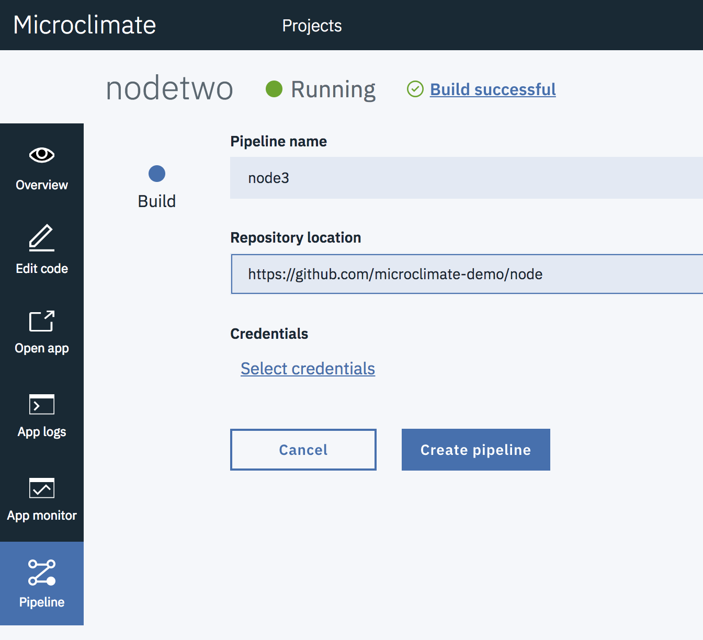

Click on Open Pipeline to get access to Jenkins  (enter your credentials at some point):

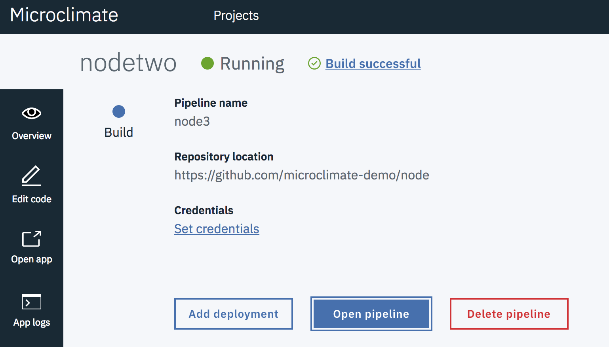

Click on **master** and look at the progression:

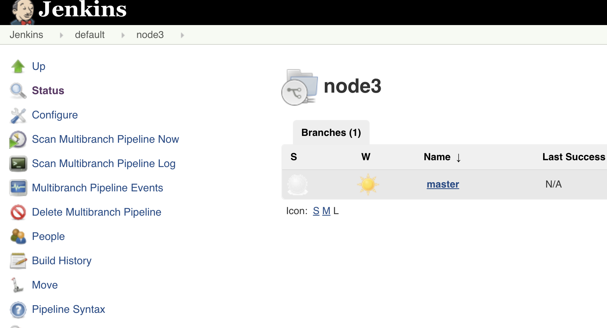

Wait until the progression ends:

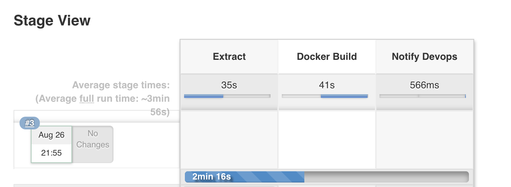


# Congratulations

You have successfully created and installed a microservice application with Microclimate.

----


<div style="background-color:black;color:white; vertical-align: middle; text-align:center;font-size:250%; padding:10px; margin-top:100px"><b>
IBM Cloud Private - Microclimate Lab
 </b></a></div>
